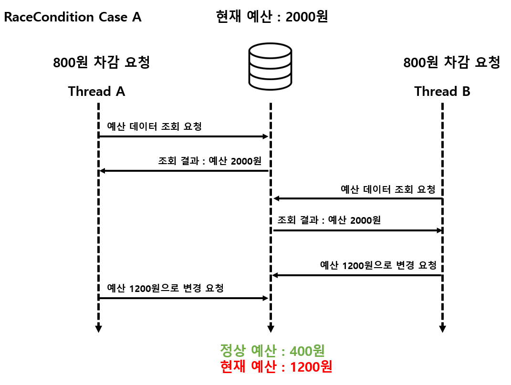
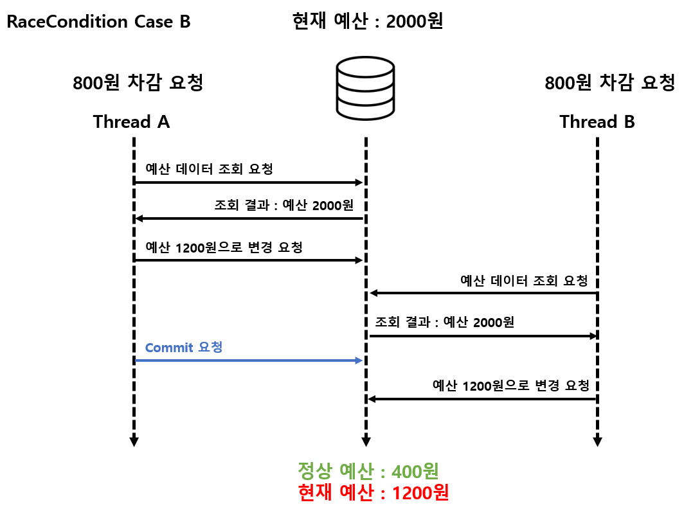
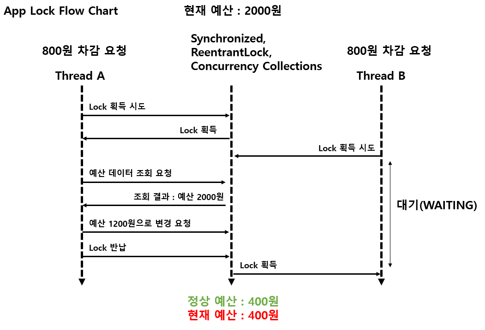
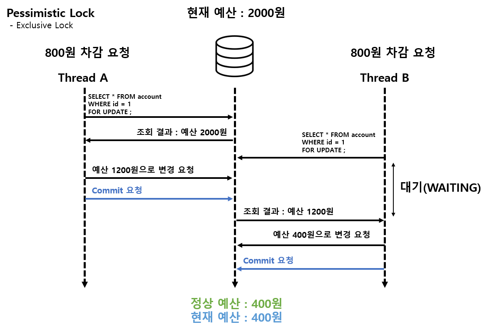
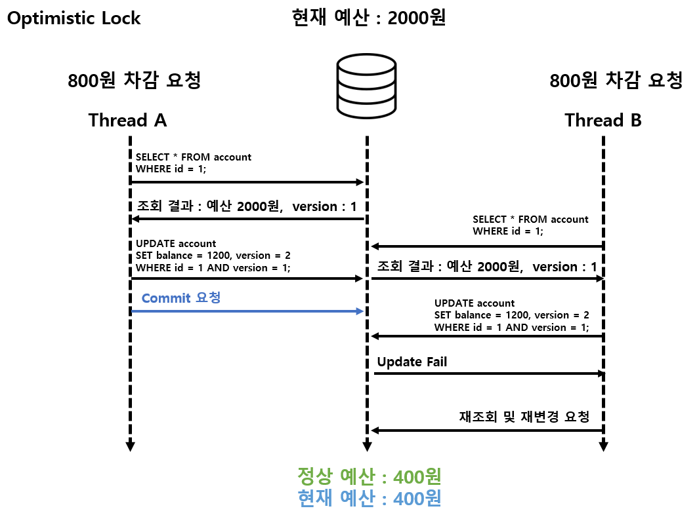
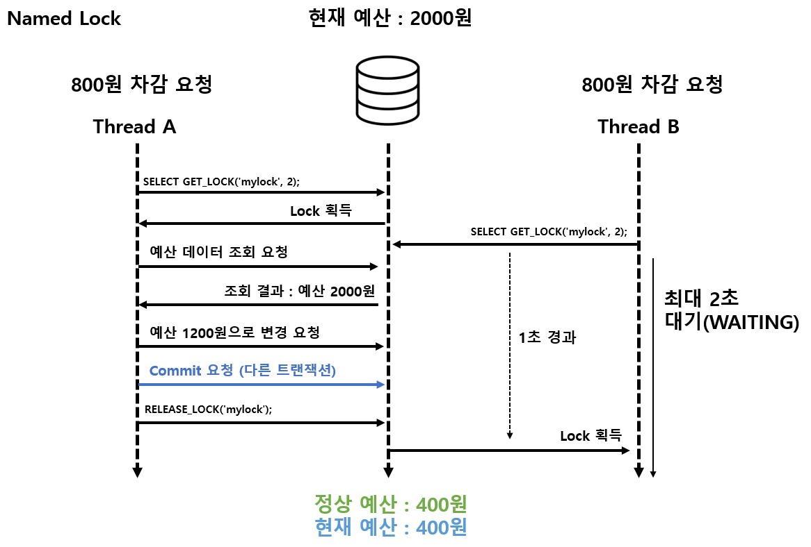
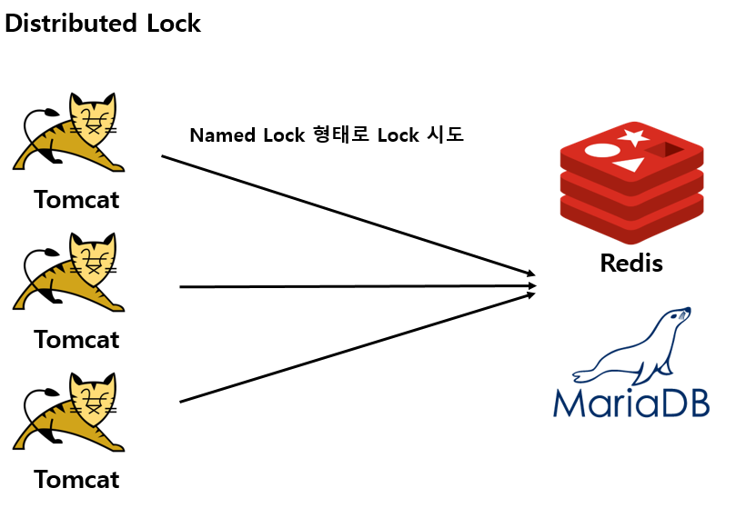
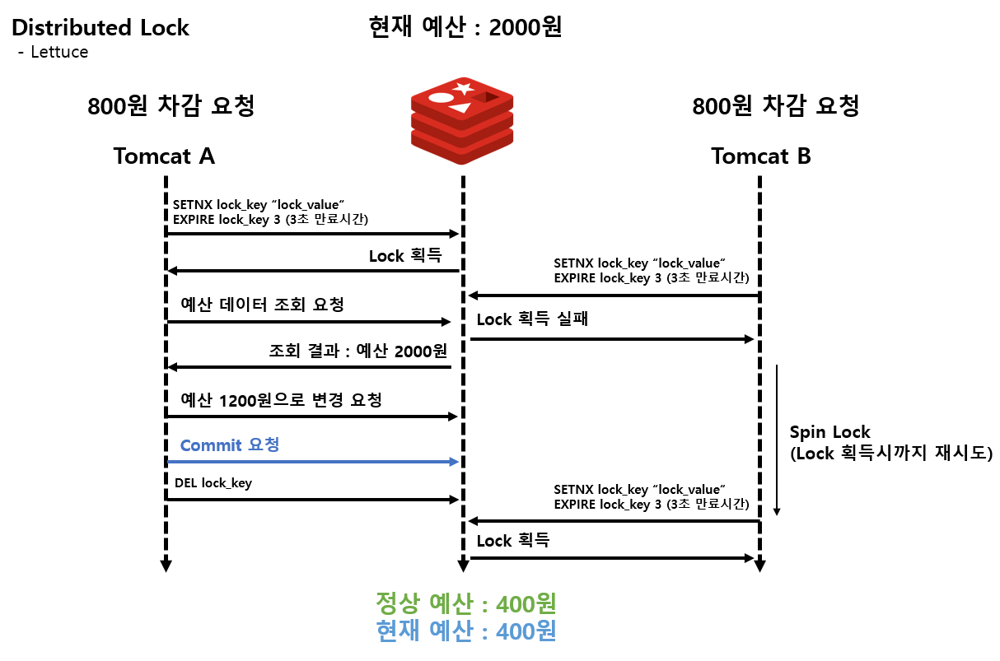
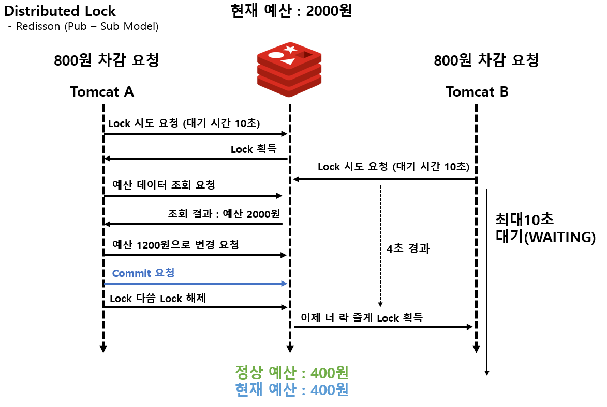

# Java로 구현하는 동시성 이슈 처리 방법

---

# 1. 개요

## 1.1 동시성 이슈란?

- 멀티 쓰레드 환경에서 여러 쓰레드가 공유 자원에 접근할 때 발생할 수 있는 이슈들을 의미
- 대표적으로 RaceCondition, DeadLock 등이 있음

## 1.2 동시성 이슈 문제점

- 동시성 이슈가 발생했을 때의 대표적인 문제는 공유 자원에 대한 데이터가 일관성이 없다는 점

  |  |  |
  |--------------------------|--------------------------------------------------------|

---

# 2. Application Lock

## 2.1 synchronized

### 2.1.1 설명

- Java에서 제공하는 동기화 키워드
- synchronized 키워드가 선언되면 Java에서는 인스턴스 단위로 Lock을 걸어서 동시성을 제어함
- 여러 쓰레드가 synchronized 영역에 접근해도 Lock을 획득한 1개의 쓰레드만 해당 로직을 수행할 수 있음

### 2.1.1 장점 및 단점

- 장점
  - 키워드 선언만으로 쉽게 동기화를 적용 할 수 있음
- 단점
  - 기본적으로 인스턴스가 Lock을 획득하기 전까지 무한대기 상태로 존재하기 때문에 성능에 악영향을 줄 수 있음
  - Lock에 대한 유효시간이나, 쓰레드에 인터럽트를 주는 등의 해제방법이 없음
  - 공정성이 없음 (여러 쓰레드가 대기상태일 때, 오래기다린 쓰레드가 Lock을 획득한다는 보장이 없음)
  - 트랙잭션 어노테이션과 같이 사용할 경우, 예상하지 못한 형태로 실행 될 수 있음 (스프링 AOP 기반 프록시 패턴 때문)

---

## 2.2 ReentrantLock

### 2.2.1 설명

- Java에서 제공하는 Lock interface 구현체
- synchronized 에서 관리하는 인스턴스 내 모니터 Lock과 다른 것임
- 다양한 형태로 Lock 획득 제어가 가능함
  - **lock()** : Lock 획득을 시도하며, 다른 쓰레드가 Lock을 획득했을 경우 대기(WAITING) 상태로 진입, Interrupt 허용안함
  - **lockInterruptibly()** : Lock 획득을 시도하며, 다른 쓰레드가 Lock을 획득했을 경우 대기(WAITING) 상태로 진입, Interrupt 허용
  - **tryLock()** : Lock 획득을 시도하며, 대기(WAITING)하지 않고 즉시 성공/실패 여부를 반환함 (true, false)
  - **tryLock(long timeout, TimeUnit unit)** : timeout으로 주어진 시간동안만 Lock 획득을 기다리고, 시간 경과시 false 반환

### 2.2.2 장점 및 단점

- 장점
  - synchronized 보다 더 유연하고 고수준의 동기화 제어가 가능함
  - Lock 획득에 공정성을 부여할 수 있음 (생성자에 true, false)
- 단점
  - 공정성을 부여할 경우 Lock 획득에 대한 성능이 느려 질 수 있음
  - 트랙잭션 어노테이션과 같이 사용할 경우, 예상하지 못한 형태로 실행 될 수 있음 (스프링 AOP 기반 프록시 패턴 때문)

---

## 2.3 Concurrency Collections

### 2.3.1 종류

- Collections.synchronizedXXX()
- ConcurrentXXX
- BlockingQueue

### 2.3.2 설명

- Java에서 제공하는 동시성 컬렉션들은 내부적으로 동기화 제어 처리가 되어 있음
- 상대적으로 성능은 Collections.synchronizedXXX() 가 제일 안좋음
  ConcurrentXXX, BlockingQueue 를 활용하는 것을 추천

### 2.3.3 장점 및 단점

- 장점
  - synchronized 를 선언하거나, Lock 획득,반환에 대해 직접 제어 하지 않아도 동시성 이슈 해결이 가능
  - 멀티쓰레드 환경에서 Thread-safe 를 보장하기 때문에 적절한 컬렉션을 사용하기만 하면 됌
- 단점
  - Thread-safe을 보장한다는 말은 내부적으로 동기화를 위한 오버헤드 비용이 발생한다는 것과 같은 맥락
  - Thread-safe를 보장하지 못하는 컬렉션에 비해 퍼포먼스가 상대적으로 좋지 않음

## 2.4 정리

- Application Level에서 사용할 수 있는 동시성 방법들은 위에 소개한 방법 외에도 다양하게 존재함
- Application Lock 은 단일 프로세스(서버)환경에서 사용하기 매우 적합함
- 하지만, 단일 서버에서 서비스를 하는 상황이 아니라면 실무에 적용하기는 한계점이 존재함<br>
  일반적인 서비스 환경에서는 2대 이상의 서버로 구성되어 있기에 우리는 다른 방법을 모색해야 함

|  |
  |--------------------------------------------------------|

# 3. DataBase Lock (MySQL, MariaDB)

## 3.1 비관적 잠금 (Pessimistic Lock)

### 3.1.1 종류

- 배타 잠금 / 쓰기 잠금 (Exclusive Lock)

    ```sql
    SELECT * FROM dreamsearch.adsite WHERE siteCode = "WwerER" FOR UPDATE;
    ```

- 공유 잠금 / 읽기 잠금 (Shared Lock)

    ```sql
    SELECT * FROM dreamsearch.adsite WHERE siteCode = "WEROIJWSDKLFsDFSDFIJIJ" FOR SHARE;
    ```

    ```sql
    SELECT * FROM dreamsearch.adsite WHERE siteCode = "WEROIJWSDKLFsDFSDFIJIJ" ;
    ```


### 3.1.2 설명

- 실제 테이블 또는 레코드에 Lock을 걸어 데이터의 정합성을 보장
- 트랙잭션 단위로 잠금이 유지되며, 다른 트랙잭션에서 Lock이 걸린 레코드에 대해 변경 할 수 없음
- commit이나 세션 종료 등의 이유로 트랙잭션이 종료된 이후 다른 트랙잭션에서 레코드 변경이 가능
- 배타잠금은 다른 트랙잭션에서 해당 레코드 변경 뿐만 아니라, 읽지도 못하게 함
- 공유잠금은 다른 트랙잭션에서 해당 레코드 변경을 못하게 막지만, 읽기는 가능

### 3.1.3 장점 및 단점

- 장점
  - 쉬운 쿼리작성을 통해 레코드에 Lock을 걸 동시성을 해결 할 수 있음
  - 동시성 이슈가 잦은 상황에서는 Optimistic Lock보다 좋은 성능을 보임
- 단점
  - InnoDB 스토리지 엔진에서만 지원함
  - InnoDB 스토리지 엔진에서 지원하는 잠금없는 읽기의 경우 Lock이 걸린 레코드도 조회 가능
  - 여러 레코드에 무분별한 Lock을 사용할 경우 데드락이 발생할 수 있음
  - Insert 로직은 Lock을 걸 수 없음

|   |
|---------------------------------------------|

---

## 3.2 낙관적 잠금 (Optimistic Lock)

### 3.2.1 설명

- 이름과 달리 실제 Lock을 사용하지 않고, 데이터의 버전을 체크함으로써 데이터 정합성을 보장 함
- 데이터를 조회한 후, update를 하는 시점에 내가 조회한 버전이 맞는지 확인하면서 변경함
- 조회한 버전과 다른 경우, application 로직에서 다시 재시도 해야 함

```sql
UPDATE stock 
SET product_id = ?, quantity = ?, version = ? -- SELECT 로 조회 버전 + 1
WHERE id = ?
AND version = ? -- SELECT로 조회한 버전
```

### 3.3.2 장점 및 단점

- 장점
  - 동시성 이슈가 많지 않을 것 같은 상황에서 적용하기 좋은 방법
  - DB에 직접 Lock을 거는 방식이 아니기에 데드락 현상을 피할 수 있음
- 단점
  - 버전이 다른 경우 update가 제대로 반영되지 않기 떄문에, 반드시 재시도 로직이 필요함
  - 동시성 이슈가 자주 발생하는 경우에는 재시도 횟수가 많아지므로 작업 시간이 길어짐
  - Insert 로직에는 적용할 수 없음

|   |
|---------------------------------------------|

---

## 3.3 네임드 락 (Named Lock)

### 3.3.1 설명

- 테이블이나 레코드 같은 단위가 아닌 임의의 문자열에 대해 Lock을 획득하고 반납하는 방식
- 트랙잭션의 종료 될 때 Lock은 반납되지 않기 때문에, 명시적으로 해제 해줘야 함
- 분산 락에서 주로 사용되는 방식이며, 오픈소스  “**ShedLock ”** 이 있음

```sql
    -- 잠금 획득 시도, 다른 트랙잭션이 잠금 사용 시 최대 2초 동안만 대기
	SELECT GET_LOCK('2024010244_배치ID', 2);  

	SELECT RELEASE_LOCK('mylock'); -- 잠금 해제(반납) 
```

### 3.3.2 장점 및 단점

- 장점
  - 배치 같이 대량의 데이터 변경이 발생하는 작업에서 비즈니스 로직 단위의 동시성 제어가 가능
  - 분산 서비스 아키텍처 환경에서 사용하기 적합
- 단점
  - Lock을 획득하는 트랙잭션과 비즈니스 로직을 진행하는 트랙잭션 분리가 필요
    같은 선상에서 트랙잭션을 묶어버리면, 비즈니스 로직이 종료되기 전에 Lock이 해제될 수 있음
  - 다른 방식에 비해 커넥션풀의 소모가 더 많음
  - Lock에 대한 해제 및 대기시간을 명시하지 않으면, 무한정 대기가 발생할 수 있음

|   |
|---------------------------------------------|

---

## 3.4 정리

- DB Lock을 통해 동시성 이슈를 처리할 수 있음을 확인
- 위에서 언급한 4개의 Lock 방식은 각각 특징이 있기 때문에 요구사항에 맞춰서 적절한 방식을 사용해야 함
- Pessimistic Lock
  - Race Condition이 많은 상황에서 데이터 정합성을 보장 할 수 있음
  - 공유잠금은 데드락을 발생 시킬 여지가 많기 때문에 되도록이면 배타잠금을 사용해야 함
  - 배타잠금의 경우 DB성능에 영향을 줄 수 있으므로 성능테스트를 하면서 적용해야 함
  - 데이터 변경에 대해서만 가능하고, 신규 적재는 Lock을 걸 수 없음
- Optimisitic Lock
  - Race Condition이 적은 상황에서 데이터 정합성을 보장하기 좋음
  - 실제 DB의 레코드나 테이블에 Lock을 걸지 않기 때문에 성능적으로 Pessimistic Lock 보다 좋음
  - 경합이 자주 발생하는 경우, 버전이 맞지않아 재시도를 자주하게 될 수 있어 적절하지 않음 (재시도 로직도 구현해야 함)
  - 데이터 변경에 대해서만 가능하고, 신규 적재는 Lock을 걸 수 없음
- Named Lock
  - 여러 레코드의 동시 변경, 여러 테이블의 잠금 등이 발생하는 경우에 사용하기 좋음
    ex) 배치
  - 동시성 이슈가 발생할 수 있는 임계영역(비즈니스 로직)에 Lock을 걸어 정합성 보장 가능
  - 분산 환경에서 단일 DB에 대해 정합성을 보장하기 용이함
  - Lock 획득, 반납의 작업이 별도의 쿼리를 사용해야 하므로, 비즈니스 로직과 별개의 커넥션을 사용 해야 함<br>
    그로인해, 커넥션의 개수가 다른 DB Lock에 비해 많이 필요하므로 사용 시 주의 필요
- DB Lock의 경우도 Master-Slave 구조로 여러 DB를 사용하는 경우 한계점이 존재함<br>
  일반적으로 Master DB는 1대를 구성하는데, DB Lock은 Slave에 걸어봤자 의미가 없기 때문에 Master에 Lock을 사용하게 됨<br>
  이러한 경우, Master DB가 단일 병목 지점이 될 수 있고 데드락 또는 커넥션 부족의 문제 등으로 서비스에 영향을 줄 수 있음

---

# 4. Distributed Lock

## 4.1  설명

- 분산 시스템 환경에서 사용하는 동시성 이슈 처리 방법
- Named Lock 의 한 종류로써, 원자적인 연산이 가능한 저장소를 활용해서 구현 함
  대표적으로 MySQL, Redis 등이 있음
- Redis의 경우 싱글 쓰레드 기반으로 동작하므로, Race Condition을 방지가능하며, InMemory DB 특성 상 속도가 매우 빨라 분산락을 구현함에 있어 가장 적합
- Redis client 중 Redisson은 내부적으로 Redlock 알고리즘을 기반으로 분산락을 구현하고 있어 클러스터링 환경에서도 동시성 이슈 처리 가능
- TTL(Time-To-Live)을 설정함으로써 Lock의 유효기간을 정할 수 있어, 무한정 대기 상태를 방지 할 수 있음

|   |
|---------------------------------------------|

---

## 4.2 Lettuce

### 4.2.1 설명

- Redis의 setnx 명령어를 활용하여 분산락을 구현
  Lock이 없으면 획득하고, 있으면 실패

### 4.2.2 장점 및 단점

- 장점
  - SpringBoot의 기본 RedisClient 이기 때문에 별도의 라이브러리 설정이 필요없음
  - 구현 자체는 매우 간단함
  - DB Level의 Named Lock과 다르게 트랙잭션이 필요없음
- 단점
  - Spin Lock 방식으로 구현해야 함 (Lock을 획득할 때 까지 시도함)
    이로 인해 Redis에 잦은 부하가 발생 할 수 있음

|   |
|---------------------------------------------|

---

## 4.3 Redisson

### 4.3.1 설명

- pub-sub 기반으로 Lock 구현체를 제공 함

### 4.3.2 장점 및 단점

- 장점
  - Spin Lock 방식이 아니기에 Redis자체에 대해 부하를 줄일 수 있음
  - Lock 획득에 대한 대기시간을 설정함으로써, 자동으로 Lock 획득에 대한 재시도 구현 가능
- 단점
  - 별도의 라이브러리 의존성을 추가해서 사용해야 함
  - 라이브러리에서 제공하는 Lock 구현체의 사용법을 익혀야 함

|   |
|---------------------------------------------|

---

## 4.4 정리

- Redis를 활용한 분산락의 경우, 앞서 소개한 방법들에 비해 가장 좋은 성능을 보여줄 수 있음
- 다중 서버, Master-Slave 구조를 대규모 트래픽 서비스에서 동시성 제어를 위해 사용하기 좋음
- Lettuce와 Redisoon 둘 중 어느 것을 사용할지는 요구사항에 따라 달라질 수 있음
- Lettuce
  - Lock 획득에 대해서 재시도가 항상 필요하지 않은 경우 적합
- Redisson
  - Lock 획득에 대해서 재시도가 필요한 경우 적합 (대기시간 설정을 통해 손 쉽게 적용)
- 그러나, Redis를 사용하지 않는 규모의 서비스에서 단순히 분산락만을 위해 적용하기에는 인프라적인 비용이 존재함
- 또한 Redis 자체에 대한 장애도 고려해야 할 요소이며, FailOver에 대해서도 고민해야 할 필요가 있음

---

# 부록

## 예제 프로젝트 환경 셋팅

### Window Docker 설치

1. Docker Desktop download ADM64 용 → install 까지 하기
2. power shell open
3. docker -v  (버전 확인)

### MariaDB 셋팅

1. power shell open
2. **docker pull mariadb** (마리아DB 이미지 다운로드)
3. **docker run  --name mariadb-container -e MARIADB_ROOT_PASSWORD=1234 -p 3306:3306 -v //c/enliple/concurrency-db/data:/var/lib/mysql -d mariadb** <br>
    (마리아DB 도커 컨테이너 백그라운드로 실행하며 데이터는 로컬PC 지정경로에 저장)<br>
    **docker ps** (실행중인 컨테이너 목록 확인)<br>
    **docker ps -a** (모든 컨테이너 목록 확인)<br>
    **docker stop mariadb-container** (마리아DB 컨테이너 중지)<br>
    **docker rm mariadb-container** (마리아DB 컨테이너에서 삭제) : mariadb-container 는 컨테이너 이름
4. **docker exec -it mariadb-container mariadb -u root -p**(실행 중인 마리아DB 컨테이너에 접속)<br>
   mariadb-container 는 실행 중인 컨테이너의 이름입니다.<br>
   -it 는 터미널 모드로 MariaDB 내부에 들어갈 수 있도록 합니다.<br>
   mariadb -u root -p 사용해서 마리아DB 컨테이너 내부 shell에 접근합니다<br>
   프롬프트가 나타나면 `MYSQL_ROOT_PASSWORD`로 설정한 비밀번호를 입력합니다.
5. root 접속 이후 데이터베이스 생성 및 사용자 생성<br>
   **create database concurrency** : concurrency 는 생성할 데이터베이스 이름<br>
   **create user 'swhan'@'localhost' identified by 'swhan2022!';** <br>
   swhan 은 사용자 계정입니다<br>
   @'localhost' 는 접속을 허용할 IP (’%’로 하면 모든 서버 접근, localhost는 로컬만)<br>
   'swhan2022!' 는 계정의 패스워드<br>
   **grant all privileges on concurrency  to ‘swhan'@'%';**<br>
   concurrency  데이터베이스에 :q1swhan계정에 모든 권한을 부여

### Redis 설치

1. **docker pull redis** - 레디스 이미지 다운로드
2. docker run —name redis-container -d -p 6379:6379 redis